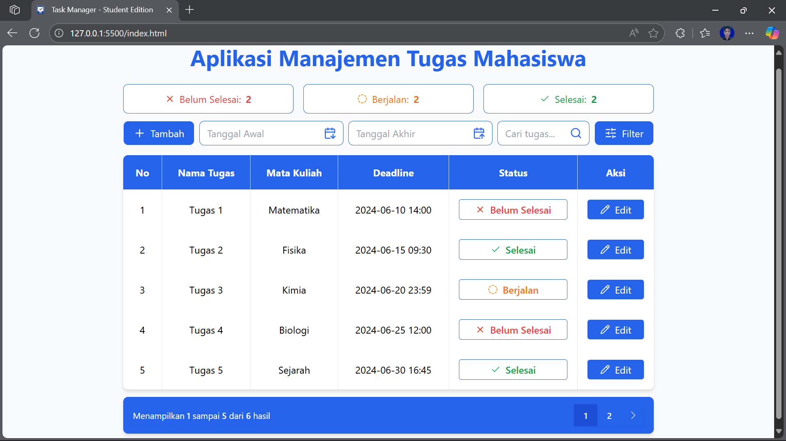
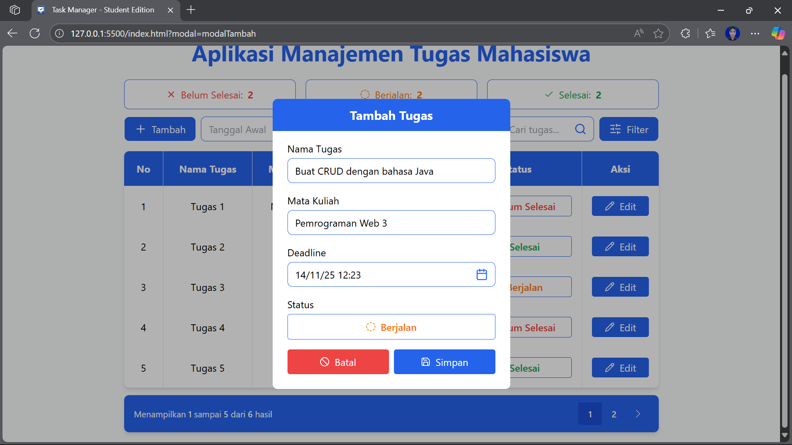
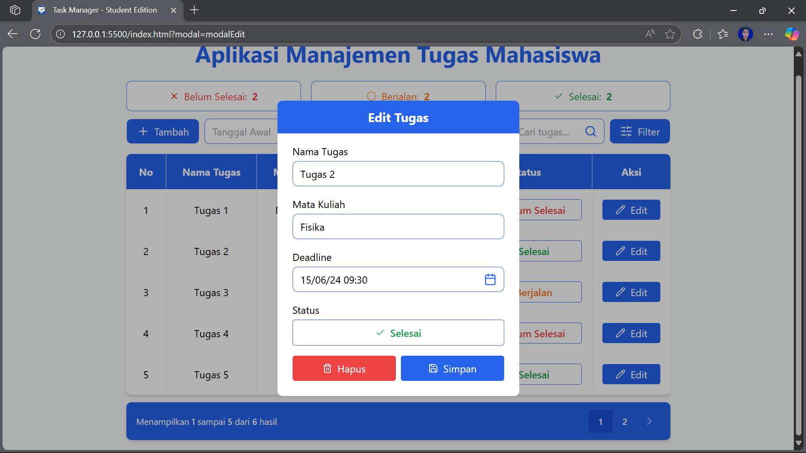
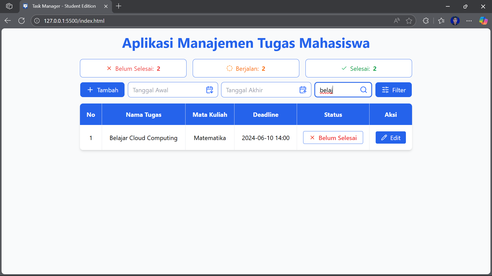
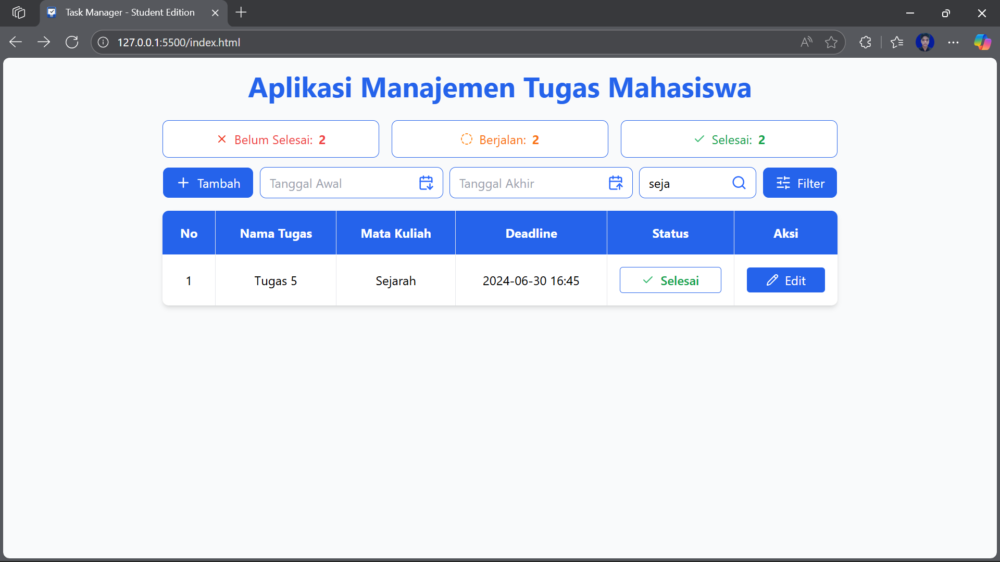
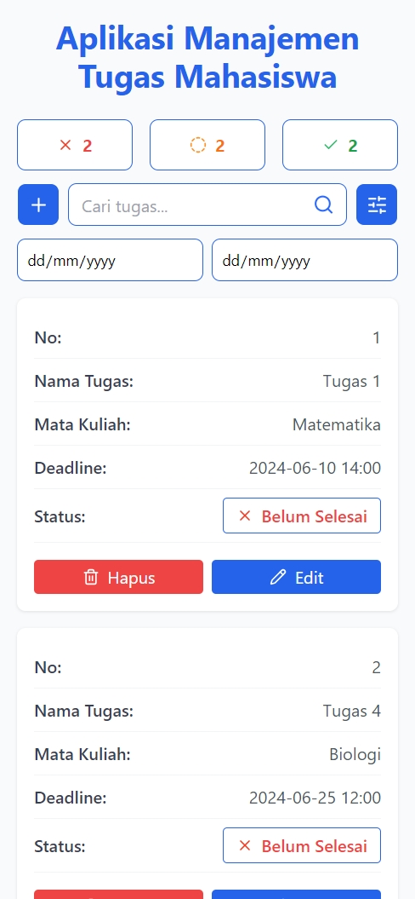
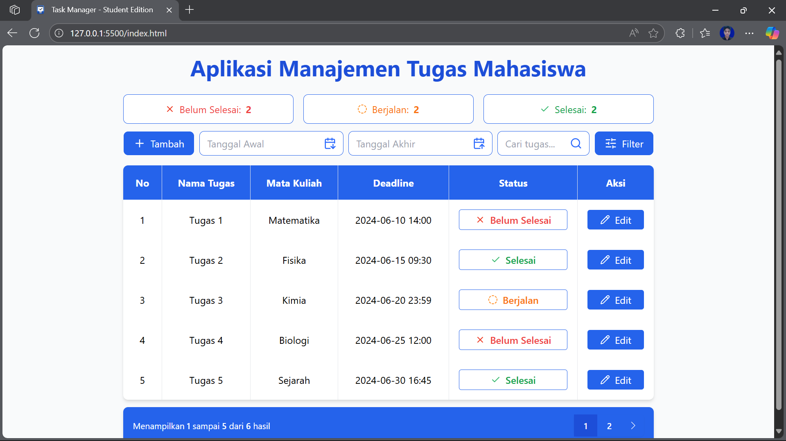
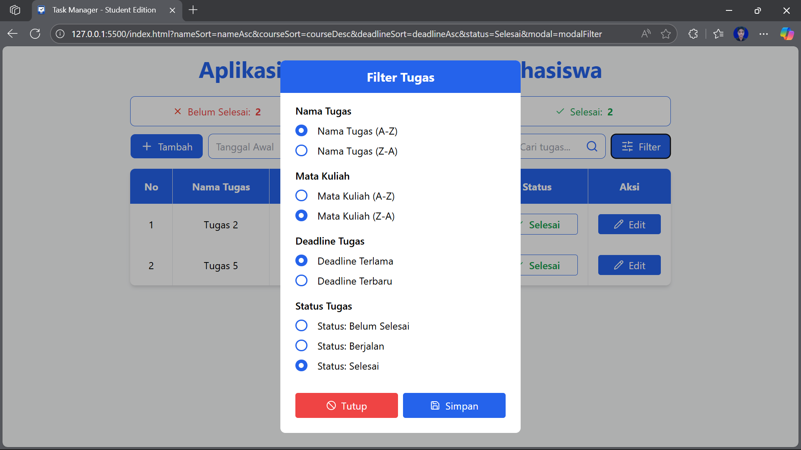
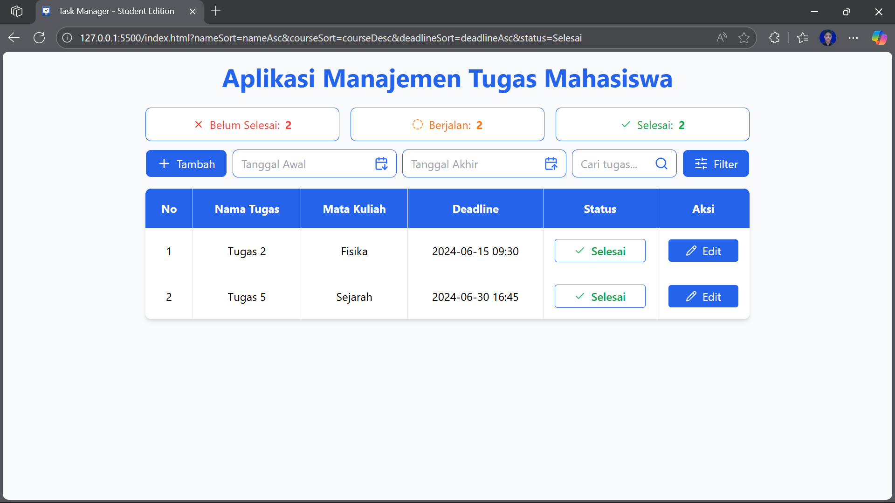

# Aplikasi Manajemen Tugas Mahasiswa

## Repository

- **GitHub:** https://github.com/Reannn22/pemrograman_web_itera_123140022
- **NIM:** 123140022
- **Nama:** Reyhan Capri Moraga
- **Praktikum:** Pemrograman Web RA

## Format Pengumpulan

Aplikasi ini membantu mahasiswa mengelola aktivitas akademik secara interaktif dan efisien. Data tugas disimpan secara lokal menggunakan localStorage sehingga tetap tersedia meskipun browser ditutup.

---

## Fitur Utama

- **Tambah Tugas:**  
  Tambahkan tugas baru dengan nama tugas, mata kuliah, dan deadline.
- **Edit Tugas:**  
  Ubah detail tugas yang sudah ada.
- **Hapus Tugas:**  
  Hapus tugas yang tidak diperlukan.
- **Status Tugas:**  
  Tandai tugas sebagai "Belum Selesai", "Berjalan", atau "Selesai".
- **Filter Tugas:**  
  Filter tugas berdasarkan nama, mata kuliah, deadline, dan status.
- **Pencarian Tugas:**  
  Cari tugas berdasarkan nama atau mata kuliah.
- **Statistik Tugas:**  
  Tampilkan jumlah tugas berdasarkan status (Belum Selesai, Berjalan, Selesai) di header.
- **Validasi Form:**  
  Nama tugas dan mata kuliah wajib diisi, deadline harus valid.
- **Penyimpanan Lokal:**  
  Data tugas tersimpan di localStorage dan otomatis dimuat saat halaman dibuka.
- **Desain Responsive:**  
  Tampilan desktop dan mobile, termasuk mobile card.
- **Refresh Cache:**  
  Tombol "Refresh Cache" untuk menghapus seluruh data localStorage dan cache aplikasi.
- **Pagination:**  
  Navigasi halaman untuk daftar tugas jika jumlah tugas banyak.
- **UI Modern:**  
  Menggunakan Tailwind CSS, ikon status berwarna sesuai status, dan badge status interaktif.
- **Pengurutan dan Filter:**
  - **Nama Tugas:**
    - Urutkan A-Z (ascending)
    - Urutkan Z-A (descending)
  - **Mata Kuliah:**
    - Urutkan A-Z (ascending)
    - Urutkan Z-A (descending)
  - **Deadline:**
    - Deadline Terlama
    - Deadline Terbaru
  - **Status:**
    - Filter Belum Selesai
    - Filter Berjalan
    - Filter Selesai
- **URL Parameters:**
  - Status filter dan pengurutan tersimpan di URL
  - Bisa share link dengan filter yang sudah diset
  - Mendukung browser back/forward navigation

---

## Cara Menjalankan

1. Clone repository sesuai format di atas.
2. Buka folder pertemuan, misal: `reyhancaprimoraga_123140022_pertemuan1`.
3. Buka file `index.html` di browser.
4. Mulai kelola tugas Anda!

---

## Screenshot Fitur-Fitur

1. **Tampilan utama aplikasi**  
   

2. **Form tambah tugas baru menggunakan parameter nama tugas, mata kuliah, deadline, dan status**  
   

3. **Form edit tugas yang sudah ada**  
   

4. **Filter cari tugas berdasarkan rentang tanggal awal dan akhir deadline**  
   

5. **Filter cari tugas berdasarkan input nama tugas**  
   

6. **Fitur cari tugas berdasarkan input nama mata kuliah**  
   

7. **Tampilan responsive di mobile**  
   

8. **Refresh Cache jika klik teks "Aplikasi Manajenen Tugas Mahasiswa"**  
   

9. **Filter dan Pengurutan Tugas**  
   
   

## Penjelasan Teknis

### Implementasi Fitur

1. **Pencarian Real-time:**

```javascript
// Pencarian otomatis saat mengetik
searchInput.addEventListener(
  "input",
  debounce(function () {
    renderTasks();
  }, 300)
);

// Filter berdasarkan nama tugas dan mata kuliah
filteredTasks = tasks.filter(
  (task) =>
    task.name.toLowerCase().includes(searchQuery) ||
    task.course.toLowerCase().includes(searchQuery)
);
```

2. **Filter Tanggal Otomatis:**

```javascript
if (startDate && endDate) {
  const start = new Date(startDate);
  const end = new Date(endDate);
  end.setHours(23, 59, 59, 999);

  filteredTasks = filteredTasks.filter((task) => {
    const taskDate = new Date(task.deadline);
    return taskDate >= start && taskDate <= end;
  });
}
```

3. **Status Counter:**

```javascript
const counts = {
  "Belum Selesai": 0,
  Berjalan: 0,
  Selesai: 0,
};
tasks.forEach((task) => counts[task.status]++);
```

4. **Responsive Design:**

```css
@media (max-width: 1024px) {
  .desktop-table {
    display: none;
  }
  .mobile-table {
    display: block;
  }
}

@media (max-width: 768px) {
  .status-text {
    display: none;
  }
  .icon-only {
    display: block;
  }
}
```

5. **Cache Management:**

```javascript
async function clearBrowserCache() {
  localStorage.clear();
  const cacheNames = await caches.keys();
  await Promise.all(cacheNames.map((name) => caches.delete(name)));
  window.location.reload(true);
}
```

6. **Form Validation:**

```javascript
<input type="text" required>
<input type="datetime-local" required>
// Validasi client-side HTML5 + custom JavaScript
```

7. **Status Toggle:**

```javascript
function toggleStatus() {
  const statuses = ["Belum Selesai", "Berjalan", "Selesai"];
  currentIndex = (currentIndex + 1) % statuses.length;
  return statuses[currentIndex];
}
```

### Teknologi yang Digunakan

1. **Frontend:**

   - HTML5 Semantic Tags
   - Tailwind CSS untuk styling
   - JavaScript ES6+ (Async/Await, Arrow Functions)
   - localStorage untuk penyimpanan data

2. **Libraries:**

   - Flatpickr untuk date picker
   - Tailwind CSS untuk UI components

3. **Browser APIs:**
   - localStorage API
   - Cache API
   - History API untuk URL state
   - DOM API

### Performance Optimizations

1. **Debouncing:**

```javascript
function debounce(func, wait) {
  let timeout;
  return (...args) => {
    clearTimeout(timeout);
    timeout = setTimeout(() => func.apply(this, args), wait);
  };
}
```

2. **Lazy Loading:**

   - Images load on demand
   - Scripts deferred loading
   - Styles non-blocking

3. **Cache Strategy:**
   - localStorage untuk data persistence
   - Browser cache untuk assets
   - Manual cache clearing option

### Security Considerations

1. **Input Sanitization:**

   - HTML escaping
   - Input validation
   - XSS prevention

2. **Data Protection:**
   - localStorage encryption
   - Secure form handling
   - No sensitive data storage

---

## Daftar Fitur yang Diimplementasikan

- CRUD tugas (Create, Read, Update, Delete)
- Penyimpanan data dengan localStorage
- Validasi form dan error handling
- Filter dan pencarian tugas
- Statistik jumlah tugas per status
- Desain UI responsive dengan Tailwind CSS
- Refresh cache (hapus semua data dan reload aplikasi)
- Pagination daftar tugas
- Dokumentasi dan struktur kode rapi
