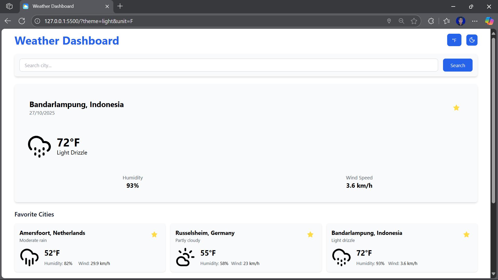
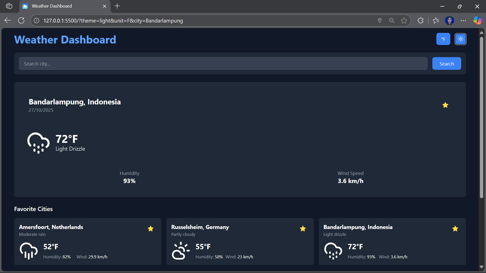
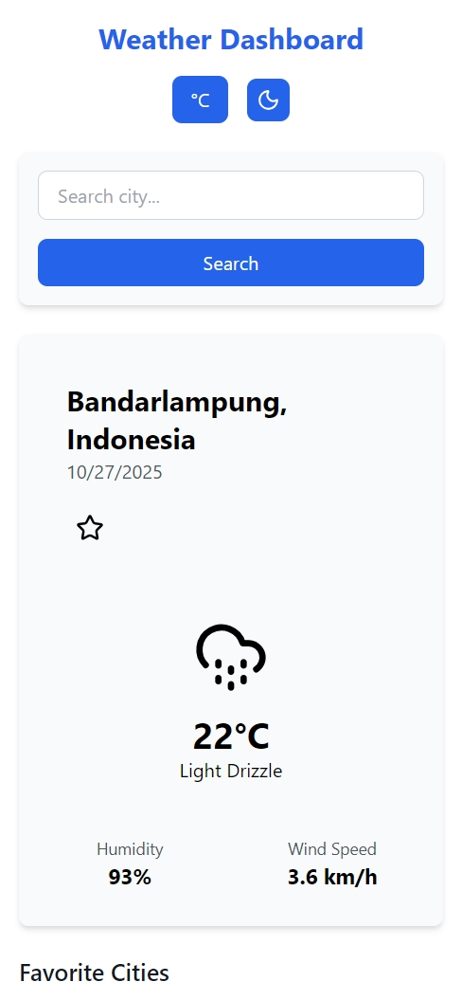
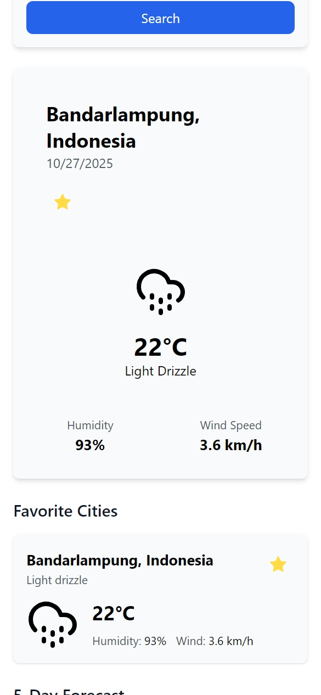
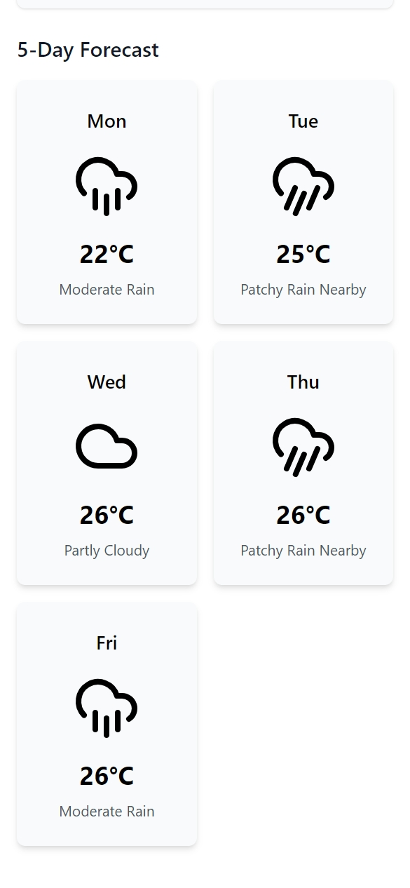
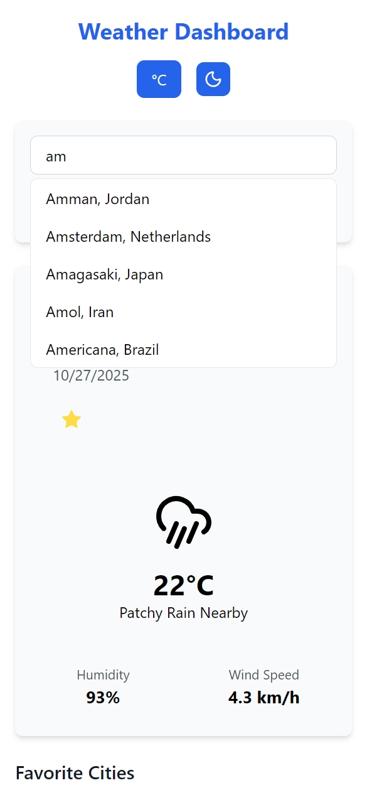
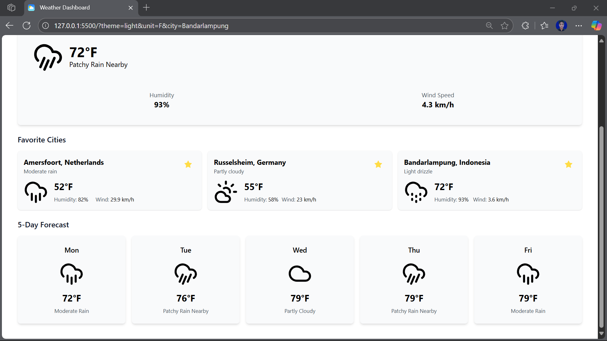
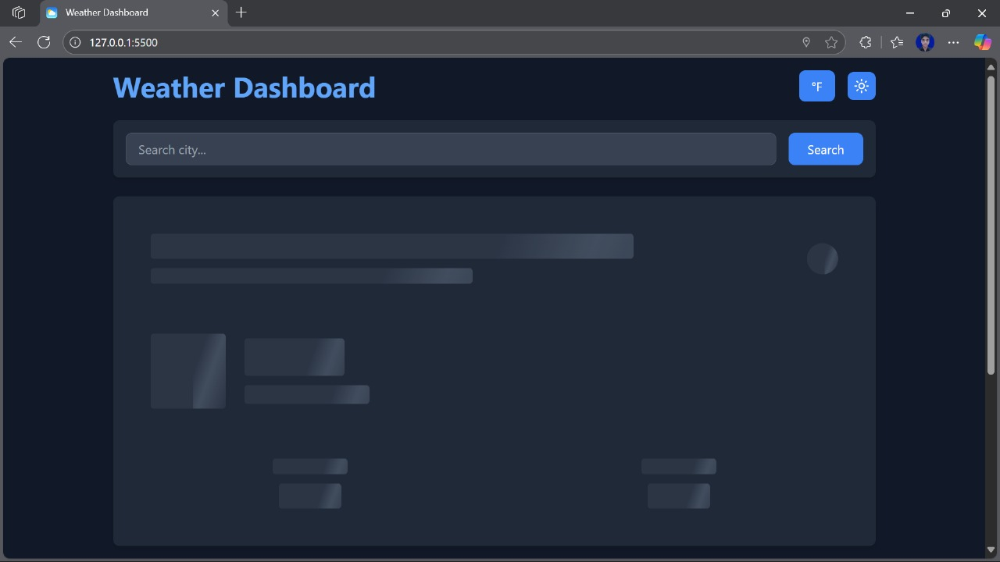

# Weather Dashboard Application

A modern weather dashboard built with JavaScript ES6+ features that allows users to search for weather information, save favorite cities, and view 5-day forecasts.

## Features

### Core Functionality

- Real-time weather data from WeatherAPI
- Current weather conditions display
- 5-day weather forecast
- Favorite cities management
- Location-based weather detection
- Search with autocomplete
- Dark/Light theme toggle
- Temperature unit conversion (°C/°F)

### ES6+ Features Implementation

1. **Class & Private Fields**

```javascript
class WeatherApp {
  #settings;
  #searchDebounceTimer;
  #isLoading;
  #favorites;

  constructor() {
    // Implementation
  }
}
```

2. **Arrow Functions**

```javascript
const getWeatherIcon = (condition) => {
  const { text } =
    typeof condition === "object" ? condition : { text: condition };
  return `assets/icon/${weatherIconMap[text] || weatherIconMap["default"]}`;
};
```

3. **Async/Await**

```javascript
async fetchWeather(city) {
    try {
        const response = await fetch(`${BASE_URL}/current.json?key=${API_KEY}&q=${city}`);
        const data = await response.json();
        // Implementation
    } catch (error) {
        this.showError(error.message);
    }
}
```

4. **Template Literals**

```javascript
weatherContainer.innerHTML = `
    <div class="flex items-center justify-between">
        <h2>${location.name}, ${location.country}</h2>
        <p>${temp}°${this.#settings.unit}</p>
    </div>
`;
```

5. **Destructuring**

```javascript
const { current, location } = data;
const { temp_c, condition, humidity } = current;
```

6. **Modern Array Methods**

```javascript
const favorites = this.#favorites
    .sort((a, b) => new Date(b.addedAt) - new Date(a.addedAt))
    .map(city => /* template */);
```

### Local Storage Implementation

- Settings storage (theme, temperature unit)
- Favorites management

```javascript
localStorage.setItem("weatherSettings", JSON.stringify(this.#settings));
localStorage.setItem("weatherFavorites", JSON.stringify(this.#favorites));
```

## Screenshots

### Desktop Views

#### Light Mode



- Clean and modern interface
- Current weather data display
- Favorites section
- 5-day forecast grid

#### Dark Mode



- Dark theme for low-light conditions
- High contrast text and icons
- Optimized readability

### Mobile Views

#### Mobile Home



- Responsive layout for small screens
- Stacked navigation elements
- Full-width search bar
- Optimized touch targets

#### Mobile Weather Display



- Compact weather information
- Touch-friendly favorite buttons
- Readable font sizes on mobile
- Efficient space usage

#### Mobile Forecast



- 2-column forecast grid on mobile
- Scrollable forecast cards
- Optimized for touch interaction

#### Mobile Search



- Full-width search suggestions
- Easy-to-tap suggestion items
- Clear visual hierarchy
- Smooth mobile interactions

### Feature Highlights

#### Favorites Management



- One-click favorite city addition
- Persistent storage across sessions
- Quick access to favorite locations
- Real-time weather updates for favorites
- Easy removal of favorites
- Automatic sorting by most recently added

#### Loading States



- Skeleton loading animation
- Responsive placeholder layouts
- Smooth loading transitions

#### Search & Autocomplete


- Real-time search suggestions
- Location autocomplete
- Quick city selection

## Responsive Design Implementation

### Mobile-First Approach

```css
/* Base mobile styles */
.container {
  padding: 1rem;
}

/* Tablet and desktop breakpoints */
@media (min-width: 640px) {
  .container {
    padding: 1.5rem;
  }
}

@media (min-width: 768px) {
  .grid {
    grid-template-columns: repeat(2, 1fr);
  }
}

@media (min-width: 1024px) {
  .grid {
    grid-template-columns: repeat(3, 1fr);
  }
}
```

### Key Responsive Features

- Flexible grid layouts
- Responsive typography
- Adaptive spacing
- Touch-optimized UI elements
- Collapsible navigation
- Optimized images
- Mobile-friendly interactions

## Technical Implementation

### ES6+ Features Used

1. **Class Fields & Methods**

   - Private class fields with # prefix
   - Class methods for encapsulation
   - Getter/setter implementation

2. **Modern JavaScript Features**

   - Arrow functions for callbacks
   - Template literals for HTML
   - Async/await for API calls
   - Destructuring in parameters
   - Spread/rest operators
   - Enhanced object literals

3. **DOM Manipulation**

   - Modern event listeners
   - Template literal rendering
   - Dynamic content updates

4. **API Integration**

   - Fetch API with async/await
   - Error handling
   - Response processing

5. **State Management**
   - Local storage integration
   - Real-time updates
   - State synchronization
