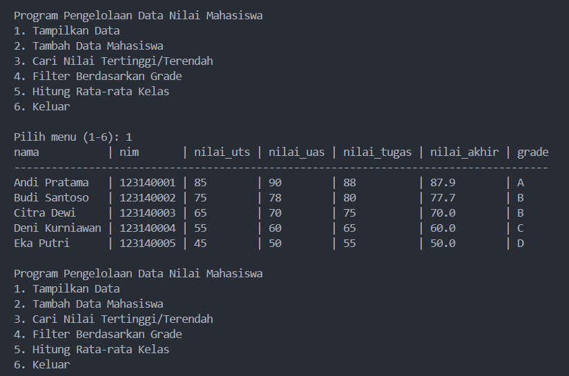
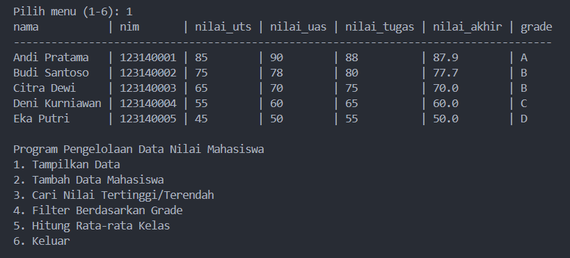
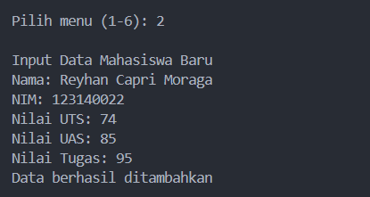
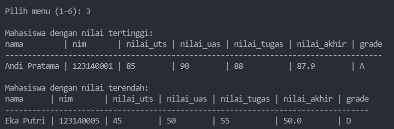
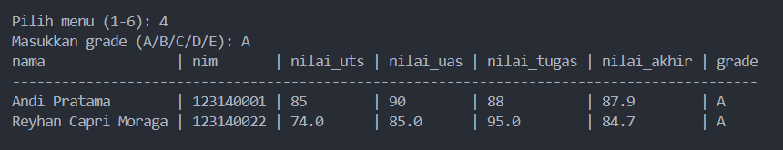
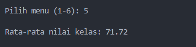

# Program Pengelolaan Data Nilai Mahasiswa

Program Python untuk mengelola data nilai mahasiswa dengan fitur lengkap.

## Deskripsi Tugas

Program ini dibuat sebagai implementasi dari Tugas Praktikum untuk mengelola data nilai mahasiswa dengan berbagai fitur yang dipersyaratkan.

## Persyaratan Sistem

### Data Mahasiswa

- List berisi minimal 5 dictionary data mahasiswa
- Setiap mahasiswa memiliki atribut:
  - Nama
  - NIM
  - Nilai UTS
  - Nilai UAS
  - Nilai Tugas

### Implementasi Fungsi

1. Perhitungan Nilai Akhir:

   - 30% UTS
   - 40% UAS
   - 30% Tugas

2. Penentuan Grade:

   - A: ≥80
   - B: ≥70
   - C: ≥60
   - D: ≥50
   - E: <50

3. Fitur Utama:
   - Tampilan data dalam format tabel
   - Pencarian nilai tertinggi/terendah
   - Input data mahasiswa baru
   - Filter berdasarkan grade
   - Perhitungan rata-rata kelas

## Struktur Project

```
data_nilai_mahasiswa/
├── data/                      # Penyimpanan data JSON
│   └── mahasiswa.json
├── modules/                   # Modul fungsionalitas
│   ├── __init__.py
│   ├── tambah_mahasiswa.py         # Input data baru
│   ├── hitung_nilai_akhir.py       # Kalkulasi nilai
│   ├── tentukan_grade.py           # Penentuan grade
│   ├── nilai_akhir_dan_grade.py    # Kalkulasi total
│   ├── cari_tertinggi_terendah.py  # Pencarian nilai
│   ├── filter_berdasarkan_grade.py # Filter grade
│   ├── rata_rata_kelas.py          # Statistik kelas
│   └── tampilkan_data.py           # Output tabel
├── utils/                     # Utilitas pendukung
│   ├── __init__.py
│   └── print_table.py              # Format tabel
├── documentation/            # Dokumentasi program
│   └── screenshots/                # Screenshot fitur
└── main.py                  # Program utama
```

## Screenshots

### 1. Menu Program


_Tampilan menu utama program dengan 6 pilihan menu_

### 2. Tampilan Data


_Tampilan daftar lengkap data mahasiswa dalam format tabel_

### 3. Tambah Data Mahasiswa


_Form pengisian data mahasiswa baru_

### 4. Cari Nilai Tertinggi/Terendah


_Tampilan hasil pencarian mahasiswa dengan nilai tertinggi dan terendah_

### 5. Filter Berdasarkan Grade


_Hasil filter data mahasiswa berdasarkan grade tertentu_

### 6. Hitung Rata-rata Kelas


_Tampilan perhitungan nilai rata-rata seluruh kelas_

## Implementasi Program

### 1. Struktur Data

- Menggunakan list of dictionaries untuk menyimpan data mahasiswa
- Format JSON untuk persistensi data
- Dictionary untuk setiap mahasiswa dengan key sesuai atribut

### 2. Modularisasi

- Pemisahan fungsi ke dalam modul terpisah
- Penggunaan package untuk organisasi kode
- Utilitas pendukung dalam package terpisah

### 3. Fitur Input/Output

- Interface menu berbasis CLI
- Validasi input pengguna
- Output terformat dalam bentuk tabel
- Penyimpanan otomatis setiap perubahan

### 4. Error Handling

- Validasi tipe data input
- Penanganan file tidak ditemukan
- Validasi rentang nilai

## Kriteria Penilaian

| Aspek                               | Bobot | Implementasi                                                   |
| ----------------------------------- | ----- | -------------------------------------------------------------- |
| Fungsi-fungsi berjalan dengan benar | 35%   | ✓ Semua fungsi terimplementasi dan berjalan sesuai spesifikasi |
| Penggunaan struktur data            | 25%   | ✓ Menggunakan list dan dictionary secara efektif               |
| Implementasi input/output           | 20%   | ✓ Interface CLI yang jelas dan validasi input                  |
| Dokumentasi dan kerapian kode       | 20%   | ✓ Kode terstruktur dan terdokumentasi dengan baik              |

## Cara Penggunaan

1. Jalankan program dengan menjalankan `main.py`
2. Pilih menu yang tersedia (1-6)
3. Ikuti instruksi yang muncul untuk setiap fitur

## Pengembang

Reyhan Capri Moraga  
123140022
