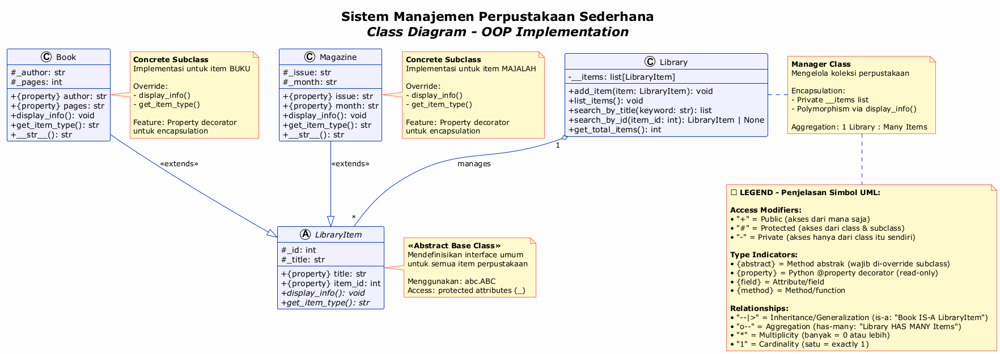
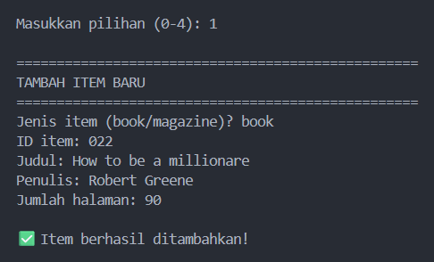
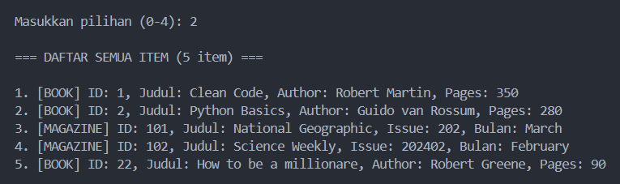
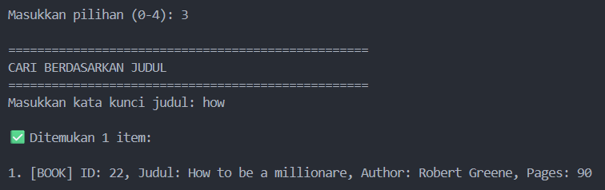
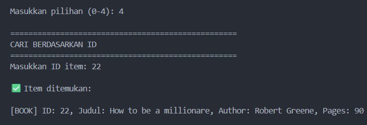

# 📚 Sistem Manajemen Perpustakaan Sederhana

**Program OOP Python | Pertemuan 5 - Praktikum Pemrograman Berorientasi Objek**

Sistem manajemen perpustakaan sederhana yang mengimplementasikan konsep-konsep Object-Oriented Programming (OOP) Python dengan menerapkan Abstract Class, Inheritance, Encapsulation, dan Polymorphism.

---

## 🎯 Tujuan Program

Membuat sistem perpustakaan yang dapat:

- ✅ Menambahkan item perpustakaan (Buku dan Majalah)
- ✅ Menampilkan daftar lengkap item
- ✅ Mencari item berdasarkan judul atau ID
- ✅ Menerapkan konsep OOP dengan baik
- ✅ Menggunakan encapsulation untuk melindungi data

---

## 📐 Konsep OOP yang Diterapkan

### 1️⃣ **Abstract Class** (Abstraksi)

```python
from abc import ABC, abstractmethod

class LibraryItem(ABC):
    @abstractmethod
    def display_info(self):
        pass
```

**Penjelasan:**

- Menggunakan modul `abc.ABC` untuk membuat abstract class
- Mendefinisikan interface/kontrak yang harus diimplementasikan subclass
- Method abstrak wajib di-override oleh setiap subclass

---

### 2️⃣ **Inheritance** (Pewarisan)

```python
class Book(LibraryItem):
    def __init__(self, item_id, title, author, pages):
        super().__init__(item_id, title)  # Memanggil parent constructor
        self._author = author
        self._pages = pages
```

**Penjelasan:**

- `Book` mewarisi dari `LibraryItem` (parent class)
- Menggunakan `super()` untuk mengakses parent constructor
- Subclass dapat menambahkan atribut dan method tambahan

---

### 3️⃣ **Encapsulation** (Enkapsulasi)

```python
class LibraryItem(ABC):
    def __init__(self, item_id, title):
        self._id = item_id          # Protected - akses dari class & subclass
        self._title = title         # Protected
```

**Penjelasan:**

- `_protected` (single underscore) = akses dalam class dan subclass
- `__private` (double underscore) = akses hanya dalam class itu sendiri
- Menggunakan @property untuk read-only access
- Melindungi data dari modifikasi tidak sengaja

---

### 4️⃣ **Polymorphism** (Polimorfisme)

```python
# Book version
class Book(LibraryItem):
    def display_info(self):
        print(f"[BOOK] ID: {self._id}, Judul: {self._title}, ...")

# Magazine version
class Magazine(LibraryItem):
    def display_info(self):
        print(f"[MAGAZINE] ID: {self._id}, Judul: {self._title}, ...")
```

**Penjelasan:**

- Setiap subclass mengimplementasikan method yang sama dengan cara berbeda
- Library dapat memanggil `display_info()` tanpa perlu tahu tipe item
- Meningkatkan fleksibilitas dan maintainability kode

---

### 5️⃣ **Property Decorator**

```python
@property
def title(self):
    """Property untuk membaca judul item (read-only)."""
    return self._title
```

**Penjelasan:**

- Decorator `@property` mengubah method menjadi attribute
- Memberikan akses read-only ke protected attribute
- Implementasi encapsulation yang lebih elegan

---

## 📁 Struktur Folder & File

```
SistemManajemenPerpustakaan/
│
├── 📄 README.md                    # Dokumentasi ini
│
├── 📂 src/                         # Folder kode sumber
│   ├── main.py                     # Program utama (entry point)
│   │
│   ├── 📂 items/                   # Package untuk item perpustakaan
│   │   ├── __init__.py
│   │   ├── library_item.py         # ✨ Abstract Class
│   │   ├── book.py                 # 📚 Subclass Book
│   │   └── magazine.py             # 📰 Subclass Magazine
│   │
│   ├── 📂 library/                 # Package untuk manager
│   │   ├── __init__.py
│   │   └── library.py              # Class Library (mengelola items)
│   │
│   ├── 📂 utils/                   # Package helper functions
│   │   ├── __init__.py
│   │   └── helpers.py              # Utility functions
│   │
│   └── 📂 diagram/                 # Diagram UML
│       └── class_diagram.puml      # PlantUML class diagram
│
├── 📂 docs/                        # Dokumentasi lengkap
│   ├── 📂 diagram/                 # Diagram hasil export
│   │   └── Sistem_Manajemen_Perpustakaan.png
│   │
│   └── 📂 screenshot/              # Screenshot hasil running
│       ├── 01_menu_utama.png
│       ├── 02_tambah_buku.png
│       ├── 03_list_items.png
│       ├── 04_search_judul.png
│       └── 05_search_id.png
│
└── 📂 out/                         # Output/hasil export
    └── (generated files)
```

---

## 🚀 Cara Menjalankan Program

### Prasyarat

- **Python 3.7+** terinstall
- **Terminal/Command Prompt** (CMD atau PowerShell)

### Langkah-Langkah

#### 1. Buka Terminal

```bash
# Windows - buka PowerShell atau Command Prompt
# Navigasi ke folder project
cd C:\Users\reyha\reyhancaprimoraga_123140022_pertemuan5
```

#### 2. Jalankan Program

```bash
python src/main.py
```

#### 3. Ikuti Menu yang Tampil

```
==================================================
        SISTEM MANAJEMEN PERPUSTAKAAN
==================================================
1. Tambah Item (Book/Magazine)
2. Tampilkan Semua Item
3. Cari Berdasarkan Judul
4. Cari Berdasarkan ID
0. Keluar
==================================================
```

---

## 📖 Penjelasan Setiap Module

### `src/items/library_item.py` - Abstract Class

| Aspek          | Deskripsi                                      |
| -------------- | ---------------------------------------------- |
| **Jenis**      | Abstract Base Class (ABC)                      |
| **Tujuan**     | Mendefinisikan interface untuk semua item      |
| **Attributes** | `_id` (int), `_title` (str) - protected        |
| **Methods**    | `display_info()`, `get_item_type()` - abstract |
| **Properties** | `title`, `item_id` - read-only                 |

**Kode Ringkas:**

```python
from abc import ABC, abstractmethod

class LibraryItem(ABC):
    def __init__(self, item_id, title):
        self._id = item_id
        self._title = title

    @property
    def title(self):
        return self._title

    @abstractmethod
    def display_info(self):
        pass
```

---

### `src/items/book.py` - Concrete Subclass

| Aspek          | Deskripsi                                    |
| -------------- | -------------------------------------------- |
| **Inherits**   | LibraryItem                                  |
| **Attributes** | `_author` (str), `_pages` (int) - protected  |
| **Methods**    | Override `display_info()`, `get_item_type()` |
| **Properties** | `author`, `pages` - read-only                |

**Contoh Output:**

```
[BOOK] ID: 1, Judul: Clean Code, Author: Robert Martin, Pages: 350
```

---

### `src/items/magazine.py` - Concrete Subclass

| Aspek          | Deskripsi                                    |
| -------------- | -------------------------------------------- |
| **Inherits**   | LibraryItem                                  |
| **Attributes** | `_issue` (str), `_month` (str) - protected   |
| **Methods**    | Override `display_info()`, `get_item_type()` |
| **Properties** | `issue`, `month` - read-only                 |

**Contoh Output:**

```
[MAGAZINE] ID: 101, Judul: National Geographic, Issue: 202, Bulan: March
```

---

### `src/library/library.py` - Manager Class

| Aspek                 | Deskripsi                                                     |
| --------------------- | ------------------------------------------------------------- |
| **Private Attribute** | `__items` - list of LibraryItem (tidak bisa diakses langsung) |
| **Core Methods**      | `add_item()`, `list_items()`                                  |
| **Search Methods**    | `search_by_title()`, `search_by_id()`                         |
| **Utility**           | `get_total_items()`                                           |

**Encapsulation Pattern:**

```python
class Library:
    def __init__(self):
        self.__items = []  # Private - hanya akses via methods

    def add_item(self, item):
        """Public method untuk modifikasi aman"""
        self.__items.append(item)
```

---

## 🎮 Contoh Penggunaan

### Scenario 1: Menambah Buku

```
Pilihan: 1
Jenis item (book/magazine)? book
ID item: 1
Judul: Clean Code
Penulis: Robert Martin
Jumlah halaman: 350

✅ Item berhasil ditambahkan!
```

### Scenario 2: Menampilkan Semua Item

```
Pilihan: 2

=== DAFTAR SEMUA ITEM (2 item) ===

1. [BOOK] ID: 1, Judul: Clean Code, Author: Robert Martin, Pages: 350
2. [MAGAZINE] ID: 101, Judul: National Geographic, Issue: 202, Bulan: March
```

### Scenario 3: Mencari Berdasarkan Judul

```
Pilihan: 3
Masukkan kata kunci judul: Clean

✅ Ditemukan 1 item:

1. [BOOK] ID: 1, Judul: Clean Code, Author: Robert Martin, Pages: 350
```

### Scenario 4: Mencari Berdasarkan ID

```
Pilihan: 4
Masukkan ID item: 101

✅ Item ditemukan:

[MAGAZINE] ID: 101, Judul: National Geographic, Issue: 202, Bulan: March
```

---

## 📊 Class Diagram UML

Berikut adalah class diagram untuk sistem perpustakaan:



**Diagram PlantUML Source:** `src/diagram/class_diagram.puml`

### Penjelasan Diagram:

```
┌─────────────────────────────────────┐
│     <<abstract>>                    │
│        LibraryItem                  │
├─────────────────────────────────────┤
│ # _id: int                          │
│ # _title: str                       │
├─────────────────────────────────────┤
│ + title: str (property)             │
│ + item_id: int (property)           │
│ + display_info(): void (abstract)   │
│ + get_item_type(): str (abstract)   │
└──────────────┬──────────────────────┘
               │ extends
        ┌──────┴──────┬──────────┐
        ▼             ▼          ▼
    ┌────────────┐ ┌──────────────┐
    │   Book     │ │  Magazine    │
    ├────────────┤ ├──────────────┤
    │ _author    │ │ _issue       │
    │ _pages     │ │ _month       │
    ├────────────┤ ├──────────────┤
    │ + author   │ │ + issue      │
    │ + pages    │ │ + month      │
    │ + display()│ │ + display()  │
    └────────────┘ └──────────────┘

┌──────────────────────────────────────┐
│         Library                      │
├──────────────────────────────────────┤
│ - __items: list[LibraryItem]         │
├──────────────────────────────────────┤
│ + add_item(item): void               │
│ + list_items(): void                 │
│ + search_by_title(keyword): list     │
│ + search_by_id(item_id): Item|None   │
│ + get_total_items(): int             │
└──────────────────────────────────────┘
           │ manages (aggregation)
           ▼
      LibraryItem (*)
```

---

## 🖼️ Screenshot Program Running

### 1. Menu Utama


**Penjelasan:**
Tampilan menu utama dengan 5 pilihan (1-4 untuk operasi, 0 untuk keluar). Program menyambut user dengan informasi demo data yang sudah loaded.

---

### 2. Menambah Item Buku



**Penjelasan:**

- User memilih opsi 1 untuk menambah item
- Program menanyakan jenis item (book/magazine)
- Untuk buku: ID, Judul, Penulis, Jumlah Halaman
- Validasi input dengan type checking
- Feedback: "✅ Item berhasil ditambahkan!"

---

### 3. Tampilkan Semua Item



**Penjelasan:**

- Menampilkan counter: "DAFTAR SEMUA ITEM (X item)"
- Setiap item ditampilkan dengan format berbeda berdasarkan tipe (polymorphism)
- Format Book: `[BOOK] ID: ..., Judul: ..., Author: ..., Pages: ...`
- Format Magazine: `[MAGAZINE] ID: ..., Judul: ..., Issue: ..., Bulan: ...`

---

### 4. Pencarian Berdasarkan Judul



**Penjelasan:**

- User input kata kunci untuk search
- Case-insensitive search (menggunakan `.lower()`)
- Menampilkan jumlah hasil yang ditemukan
- Setiap hasil ditampilkan dengan format masing-masing tipe item
- Feedback jika tidak ditemukan: "❌ Tidak ada item dengan judul 'xyz'"

---

### 5. Pencarian Berdasarkan ID



**Penjelasan:**

- User input ID (integer)
- Linear search melalui koleksi items
- Menampilkan detail item jika ditemukan
- Feedback jika tidak ditemukan: "❌ Item dengan ID X tidak ditemukan"
- Validasi tipe data: "❌ ID harus berupa angka"

---

## ✅ Pemenuhan Persyaratan Tugas

| No  | Persyaratan                  | Status | Penjelasan                                          |
| --- | ---------------------------- | ------ | --------------------------------------------------- |
| 1   | Abstract Class `LibraryItem` | ✅     | File: `src/items/library_item.py` menggunakan `ABC` |
| 2   | Minimal 2 Subclass           | ✅     | `Book` dan `Magazine` di `src/items/`               |
| 3   | Implementasi method abstrak  | ✅     | `display_info()` dan `get_item_type()` di-override  |
| 4   | Class Library                | ✅     | `src/library/library.py` mengelola koleksi          |
| 5   | Encapsulation                | ✅     | Protected (`_`) dan Private (`__`) attributes       |
| 6   | Property Decorator           | ✅     | `@property title`, `@property author`, dll          |
| 7   | Menambah item                | ✅     | Menu opsi 1 - CRUD create dengan validasi           |
| 8   | Menampilkan daftar           | ✅     | Menu opsi 2 - display semua dengan polymorphism     |
| 9   | Mencari item                 | ✅     | Menu opsi 3, 4 - search functionality               |
| 10  | Dokumentasi kode             | ✅     | Docstring di setiap class dan method                |

**Total Pemenuhan: 10/10 ✅**

---

## 🧪 Testing & Validasi

### Test Case 1: Menambah Buku

```python
from src.items.book import Book
from src.library.library import Library

lib = Library()
book = Book(1, "Clean Code", "Robert Martin", 350)
lib.add_item(book)
assert lib.get_total_items() == 1  # ✅ PASS
```

### Test Case 2: Polymorphism

```python
book = Book(1, "Clean Code", "Robert Martin", 350)
mag = Magazine(101, "National Geographic", "202", "March")

lib = Library()
lib.add_item(book)
lib.add_item(mag)

lib.list_items()  # ✅ Output berbeda untuk setiap tipe
```

### Test Case 3: Encapsulation

```python
book = Book(1, "Clean Code", "Robert Martin", 350)
title = book.title  # ✅ Akses via property (read-only)
print(title)  # Clean Code

# Tidak bisa diubah langsung
# book.title = "New Title"  # ❌ AttributeError - read-only
```

### Test Case 4: Search Functionality

```python
lib = Library()
lib.add_item(Book(1, "Python 101", "Author A", 100))
lib.add_item(Book(2, "Python Advanced", "Author B", 200))

results = lib.search_by_title("Python")
assert len(results) == 2  # ✅ PASS

item = lib.search_by_id(1)
assert item.title == "Python 101"  # ✅ PASS
```

---

## 📝 Dokumentasi Kode

Setiap file Python memiliki:

- ✅ **Module docstring** - Penjelasan file
- ✅ **Class docstring** - Penjelasan class lengkap
- ✅ **Method docstring** - Penjelasan method, parameters, return value
- ✅ **Inline comments** - Penjelasan logic penting
- ✅ **Type hints** - Type data parameter dan return value (dalam komentar)

**Contoh Format Dokumentasi:**

```python
class Book(LibraryItem):
    """
    Class untuk merepresentasikan Buku di perpustakaan.

    Attributes:
        _author (str): Nama penulis buku (protected)
        _pages (int): Jumlah halaman (protected)

    Methods:
        display_info(): Menampilkan informasi buku
        get_item_type(): Mengembalikan tipe item "Book"
    """

    @property
    def author(self):
        """
        Property untuk membaca nama penulis (read-only).

        Returns:
            str: Nama penulis buku
        """
        return self._author
```

---

## 🎓 Pelajaran Kunci

Dari implementasi sistem ini, kita belajar:

1. **Abstract Class**

   - Mendefinisikan kontrak yang harus diikuti subclass
   - Mencegah instantiasi langsung
   - Gunakan `abc.ABC` dan `@abstractmethod`

2. **Inheritance**

   - Memanfaatkan kode yang sudah ada (DRY principle)
   - Menggunakan `super()` untuk akses parent
   - Menghindari code duplication

3. **Polymorphism**

   - Menambah fleksibilitas tanpa mengubah existing code
   - Same interface, different implementation
   - Memudahkan extension dan maintenance

4. **Encapsulation**

   - Melindungi data internal dari akses tidak sengaja
   - Protected (`_`) dan Private (`__`) attributes
   - Public methods untuk controlled access

5. **Property Decorator**
   - Membuat interface yang clean
   - Implementasi read-only attributes
   - Separasi antara internal dan external representation

---

## 🔗 Referensi & Resource

- **Python ABC Module:** https://docs.python.org/3/library/abc.html
- **OOP Python Guide:** https://docs.python.org/3/tutorial/classes.html
- **PlantUML Documentation:** https://plantuml.com/
- **Python Properties:** https://docs.python.org/3/library/functions.html#property

---

## 📞 Informasi Penulis

**Nama:** Reyhan Capri Moraga  
**NIM:** 123140022  
**Mata Kuliah:** Praktikum OOP Python - Pertemuan 5  
**Universitas:** [Nama Universitas]  
**Tanggal:** 2024  
**Tahun Akademik:** 2024/2025

---

## 📄 Lisensi & Catatan

Proyek ini dibuat untuk keperluan akademik sebagai tugas praktikum pemrograman berorientasi objek. Silakan gunakan, modifikasi, dan kembangkan sesuai kebutuhan.

### Catatan Implementasi:

- ✅ Mengikuti PEP 8 Python Style Guide
- ✅ Menggunakan best practice OOP
- ✅ Clean code dengan meaningful names
- ✅ Comprehensive documentation

---

**⭐ Terima kasih telah menggunakan Sistem Manajemen Perpustakaan! ⭐**

_Jika ada pertanyaan atau saran, silakan hubungi melalui email atau platform learning management._
